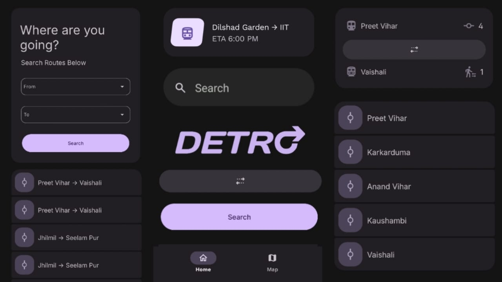

# Detro - Navigating Transit, Made Simple

The problem with most transit apps is that they suck bluntly. They look like they were designed for 80-year-olds, the whole layout is cluttered, and they never seem to follow any uniform design language. Poor UI, confusing menus, and unnecessary distractions make something as simple as navigating the city way harder than it should be.

**Detro was built to fix exactly that.**

I wanted a clean, minimal, distraction-free transit experience designed to help you move through the city effortlessly. Honestly, if I am gonna travel in the metro, I'll do it my way.

## Let's See It in Action First, Then We'll Break It Down

### 1. Native Design & Dynamic Colors

Detro tightly follows **Google’s Material 3 design system**, ensuring every component feels familiar and native on Android. None of that weird, laggy cross-platform jank. 

The app supports both light and dark modes, and on Android 12+ it automatically adapts to your device’s **dynamic color theme**, making the interface feel naturally integrated with whatever wallpaper you are using. Also, the default dark mode with those purple accents isn't just to look cool—it's deliberately chosen to reduce eye strain when you're checking your phone in a dimly lit underground metro station.

### 2. Distraction-Free Interface

Detro focuses on one thing only: **getting you where you need to go**.

Most transit apps try to do everything at once, filling the interface with banners, irrelevant features, and clutter that commuters literally never use. The result is just friction.

Detro takes a completely different approach. The **trip planner is placed front and center**, making it immediately accessible the second you open the app. This keeps the interface focused on what actually matters. There are zero unnecessary taps to get your route. You open the app, enter your destination, and start moving. 

### 3. The Brains: Custom Pathfinding

But a transit app can't just look pretty; it has to be insanely fast. 

Instead of plugging in some bloated third-party API that takes forever to load over a bad mobile network, the routing logic is built from the ground up. I implemented a custom pathfinding engine using **Dijkstra's Algorithm**. It calculates the shortest path, handles complex interchanges, and figures out walking distances between nodes efficiently behind the scenes. You don't see the math, you just get the fastest route instantly.

### 4. Built for Flow

I actually started prototyping this whole concept in Sketchware just to map out the user flow and see if the idea made sense in my hands. Once the UX felt right, I moved the entire build to **Android Studio** to get proper performance and that sleek Material 3 architecture. 

It took a lot of caffeine to get the logic right, but the end result is an app that actually respects the user's time.
